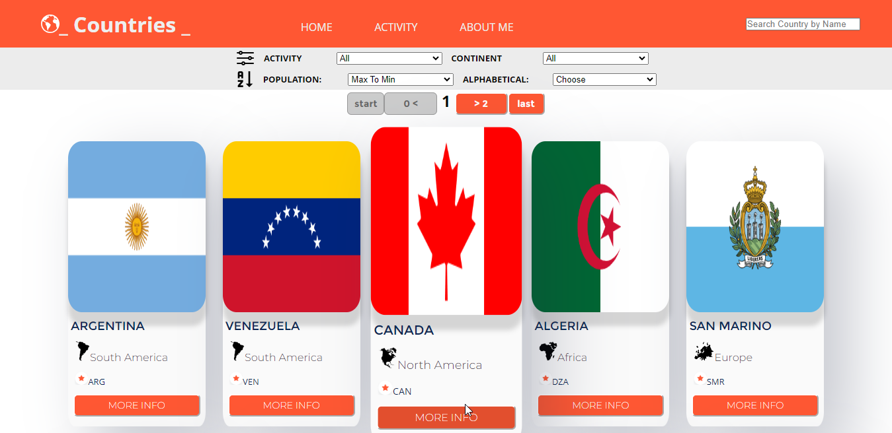
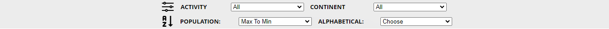

# DESCRIPCIÓN BREVE
Se creo una SPA para trabajar con Países y Actividades de acuerdo al País, la información de los Países se obtuvo de una api creada en un archivo db.json, de esta Api se pasaron a una DB en Postgres.
Se creo un servidor y rutas además de Handlers y Controllers para comunicarnos con la DB y así obtener todos los datos como también crear actividades.

## DIGRAMA DE FUNCIONAMIENTO DEL BACK

## DIAGRAMA DE FUNCIONAMIENTO DEL FRONT

Acá podemos ver el flujo de como funciona la SPA de Countries.

## INSTRUCCIONES:
La SPA corre en http://localhost:3000/
Al Iniciar carga:

### 1. Landing Page
 Esta contiene una imagen referente al proyecto y un botón de “Enter” para acceder al home.

Luego de acceder al Home podrás ver:

### NAV BAR

También posee una Nav Bar que cuenta con un cuadro de búsqueda, que te permite ir filtrando los países por el nombre.

Además, contiene 3 links principales:
* **HOME** 	    → Que permite acceder al Home o Inicio.
* **ACTIVITY**  → Que te permite Crear actividades, y ver todas las actividades creadas.´
* **ABOUT ME** → Contiene una breve descripción de mi.

### HOME
Al Entrar ingresa automáticamente el http://localhost:3000/home en esta vista podemos ver las tarjetas de todos los Países paginadas de 10 en 10.

Cada Tarjeta contiene la siguiente información:

Al Hacer Clic en el botón **MORE INFO**, puedes acceder a la Información Detallada de cada País.

Para volver al **Home**, basta con hacer clic en el Botón _“Go Home”_ o en el link _“Home”_.
Dentro del home en la parte superior tendrás disponible las opciones para manejar la forma de ordenar y filtrar las tarjetas.
Barra de Filtros y Ordenamiento

## FILTROS:

### Filtrar por Actividad:
 Te mostrará todas las actividades creadas, y al ser seleccionada te mostrará los países asociados a esa actividad.

### Filtrar por Continente: 
Te mostrará como opción los continentes de los países, y al hacer clic en él te mostrará solo los países pertenecientes a dicho continente, también puedes hacer clic en All y te mostrará todos los países.

## ORDEN:

### Ordenar Alfabéticamente: 
Ordenará las tarjetas para ser mostradas de forma alfabética de la AZ o ZA según el nombre del País.
### Ordenar por Población: 
Ordenará las tarjetas para ser mostradas de acuerdo a la cantidad de población de Mayor a Menor o de Menor a Mayor. 

## ACTIVITY
En el Activity podemos ver 2 cosas:

Te mostrará un Form.
<table>
    <tr>
	  <td width="50%">
        
	  </td>
	  <td width="50%">
        <h4> * Name (Nombre de la actividad) </h4> 
        <h4> * Season (temporada en que se práctica dicha actividad)</h4> 
        <h4> * Duration (tiempo aproximado en horas que toma practicar dicha actividad).</h4> 
        <h4> Difficulty (Categorizar de 1 al 5 el nivel de dificulta de la actividad).</h4> 
        <h4> Country (Seleccionar los Paises en que se puede practicar dicha actividad). </h4> 
      </td>
    </tr>
</table>
*Estos campos son obligatorios. No pueden dejarse vacíos.

#

## Ver Todas las Actividades

Aquí muestra todas las actividades que fueron creadas ordenadas por id.

Por cada actividad se muestra la bandera correspondiente al País, Nombre de la actividad, Temporada, Duración y Dificultad.

